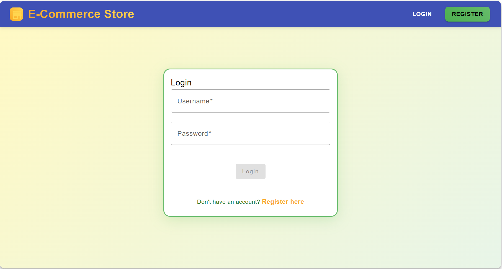
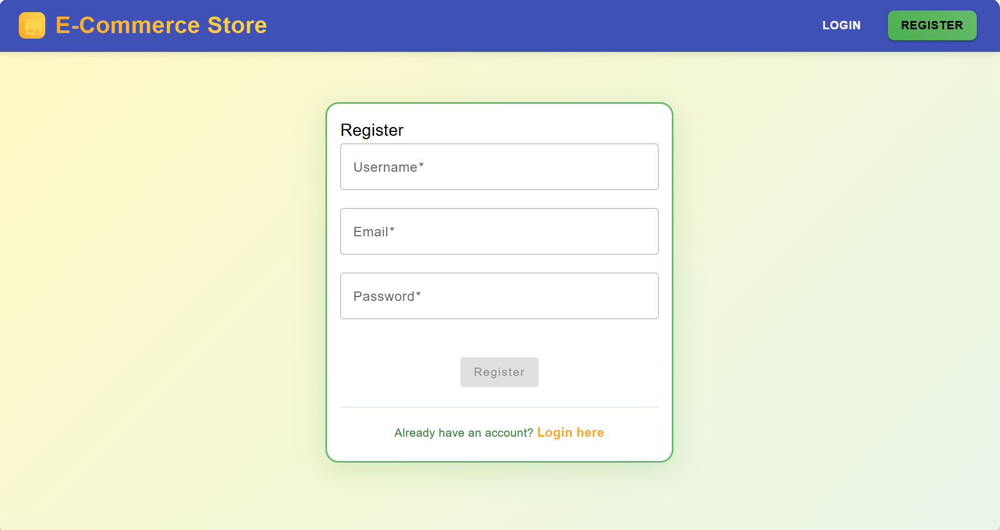
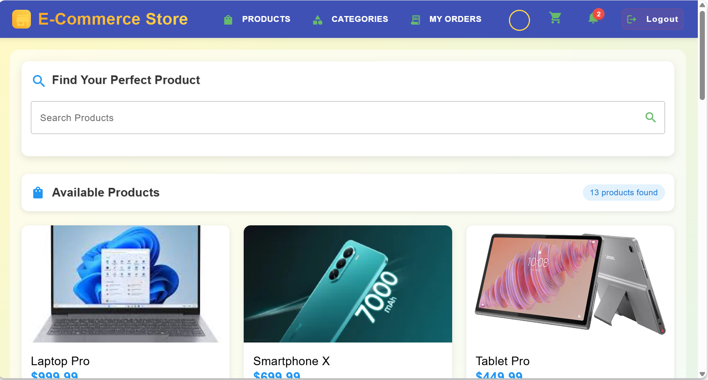
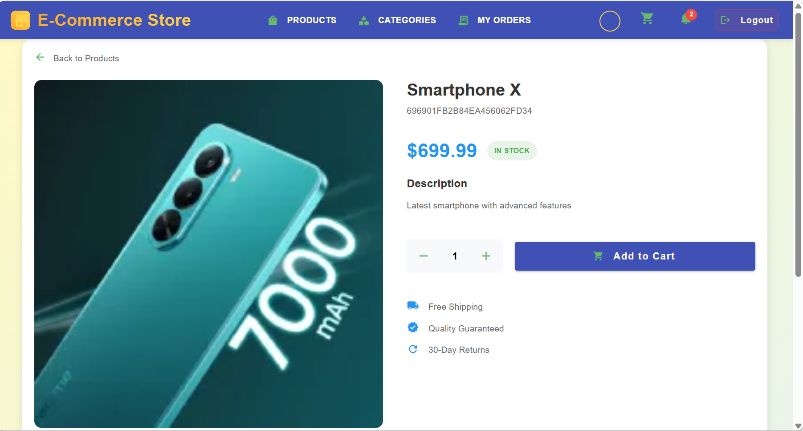
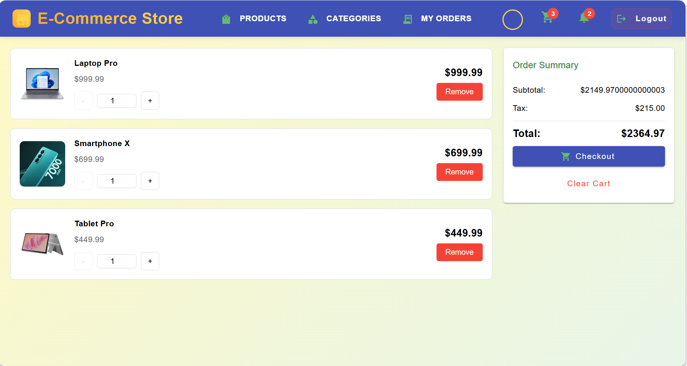
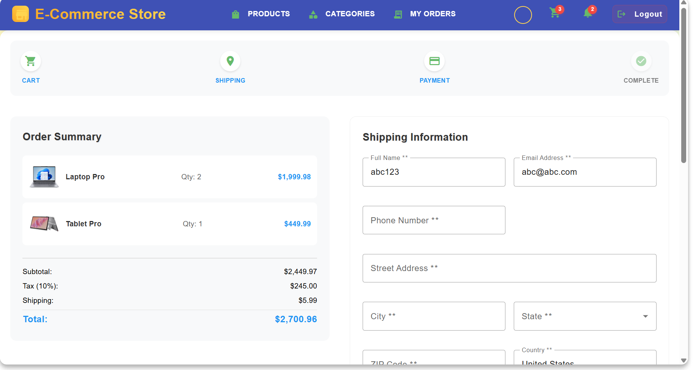
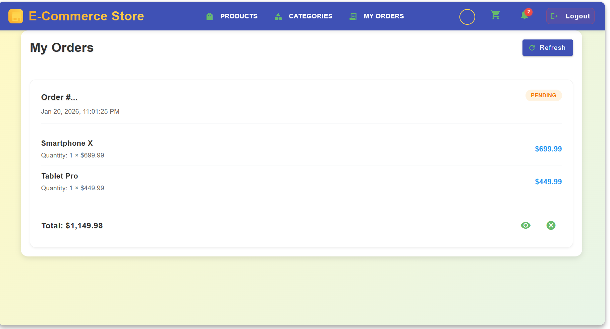
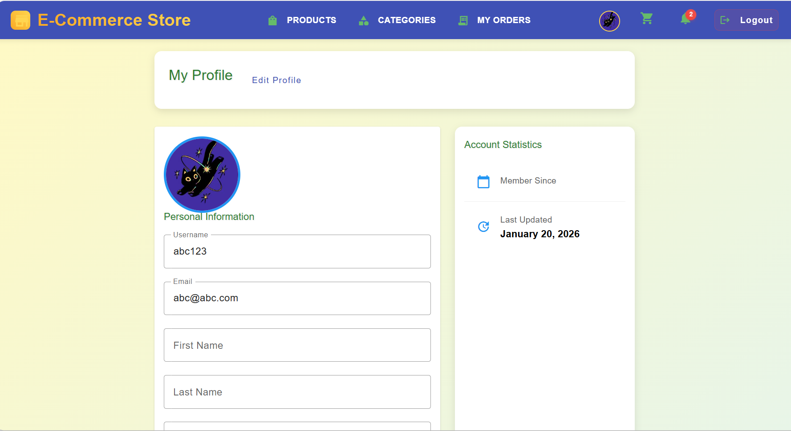
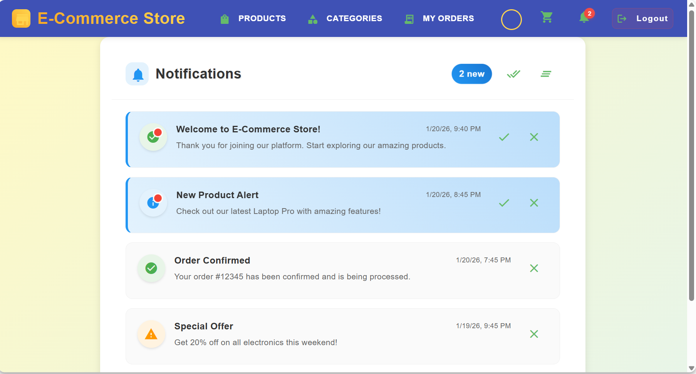
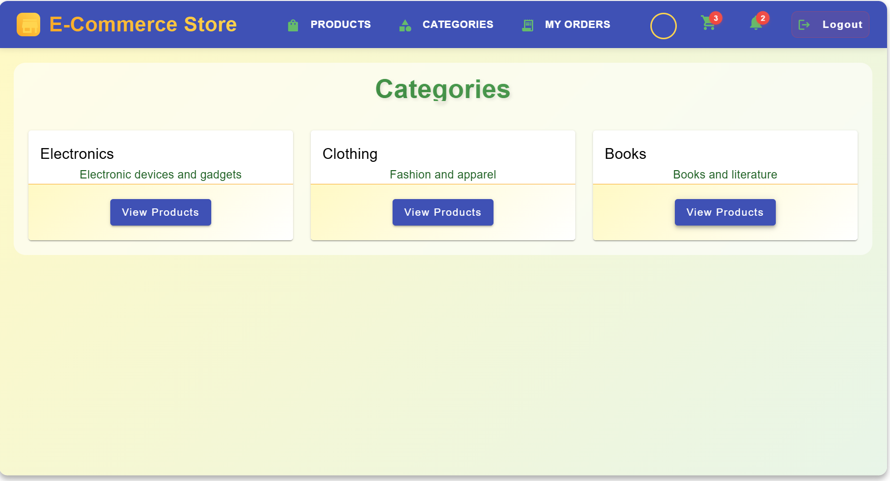

# E-commerce Web Application

A full-stack e-commerce application built with Spring Boot and Angular, featuring JWT authentication, role-based access control, and MongoDB integration.

## 📸 Application Screenshots

### 🏠 Login & Registration

*Clean and modern login interface with JWT authentication*


*User registration form with validation*

### 🛍️ Product Catalog

*Product grid with search, filtering, and add-to-cart functionality*


*Detailed product view with specifications and reviews*

### 🛒 Shopping Cart

*Cart management with quantity controls and checkout*

### �️ Checkout Process

*Complete checkout flow with shipping information, payment options, and order placement*

### � Order Management

*Order history with status tracking and cancellation functionality*

### 👤 User Profile

*Complete user profile management with profile picture upload, personal information editing, and account statistics*

### 🔔 Notifications

*Real-time notifications with mark as read functionality*

### 📱 Categories

*Product category browsing with filtering*

### 🎨 Responsive Design

*Fully responsive design for mobile devices*

## Architecture

### Backend (Spring Boot)
- **Framework**: Spring Boot 3.2.0
- **Database**: MongoDB
- **Authentication**: JWT with Spring Security
- **Build Tool**: Maven
- **Java Version**: 18

### Frontend (Angular)
- **Framework**: Angular 17
- **UI Library**: Angular Material
- **Styling**: CSS
- **HTTP Client**: Angular HttpClient
- **State Management**: RxJS

## Features

### Authentication & Authorization
- User registration and login
- JWT-based authentication
- Role-based access control (USER, ADMIN)
- Protected routes and API endpoints

### Product Management
- Browse products with pagination
- Search products by name
- Filter products by category
- Product CRUD operations (admin only)

### Category Management
- View product categories
- Category CRUD operations (admin only)

### Order Management
- Create orders from cart items
- View order history
- Track order status (PENDING, CONFIRMED, SHIPPED, DELIVERED, CANCELLED)
- Order cancellation (PENDING orders only)
- Order management (admin only)

### User Interface
- Responsive Material Design
- Modern, clean interface
- Mobile-friendly layout
- Intuitive navigation
- User profile management
- Profile picture upload with MongoDB storage
- Personal information editing
- Account statistics

## Project Structure

```
E-commerce app/
├── backend/
│   ├── src/main/java/com/ecommerce/
│   │   ├── controller/     # REST API controllers
│   │   ├── service/        # Business logic
│   │   ├── repository/     # Data access layer
│   │   ├── model/          # Entity classes
│   │   ├── dto/            # Data transfer objects
│   │   ├── security/       # Security configuration
│   │   └── config/         # Application configuration
│   ├── src/main/resources/
│   └── pom.xml
├── frontend/
│   ├── src/app/
│   │   ├── components/     # Angular components
│   │   ├── services/       # HTTP services
│   │   ├── models/         # TypeScript interfaces
│   │   ├── guards/         # Route guards
│   │   └── material.module.ts
│   ├── src/assets/
│   └── package.json
└── README.md
```

## Getting Started

### Prerequisites
- Java 17+
- Maven 3.6+
- Node.js 16+
- MongoDB
- Angular CLI 17+

### Installation Steps

1. **Clone the repository** (if applicable)

2. **Backend Setup**:
   ```bash
   cd backend
   mvn clean install
   mvn spring-boot:run
   ```
   The backend will start on `http://localhost:8080`

3. **Frontend Setup**:
   ```bash
   cd frontend
   npm install
   ng serve
   ```
   The frontend will start on `http://localhost:4200`

4. **Database Setup**:
   - Ensure MongoDB is running on `localhost:27017`
   - The application will automatically create the `ecommerce_db` database
   - Sample data will be populated on first startup

## API Endpoints

### Authentication
- `POST /api/auth/signin` - User login
- `POST /api/auth/signup` - User registration

### Products
- `GET /api/products` - Get all products
- `GET /api/products/{id}` - Get product by ID
- `GET /api/products/search?keyword={keyword}` - Search products
- `POST /api/products` - Create product (admin only)
- `PUT /api/products/{id}` - Update product (admin only)
- `DELETE /api/products/{id}` - Delete product (admin only)

### Categories
- `GET /api/categories` - Get all categories
- `GET /api/categories/{id}` - Get category by ID
- `POST /api/categories` - Create category (admin only)
- `PUT /api/categories/{id}` - Update category (admin only)
- `DELETE /api/categories/{id}` - Delete category (admin only)

### Orders
- `GET /api/orders` - Get all orders (admin only)
- `GET /api/orders/my-orders` - Get current user's orders
- `GET /api/orders/{id}` - Get order by ID
- `POST /api/orders` - Create order
- `PUT /api/orders/{id}/status` - Update order status (admin only)
- `DELETE /api/orders/{id}` - Delete order (admin only)

## Default Data

The application automatically initializes with:
- **Roles**: USER, ADMIN
- **Categories**: Electronics, Clothing, Books
- **Sample Products**: Various products in each category

## Security Features

- JWT tokens with configurable expiration
- Password encryption with BCrypt
- CORS configuration for frontend-backend communication
- Role-based method-level security
- Input validation and sanitization

## Development Notes

### Backend
- Uses Spring Data MongoDB for database operations
- Implements RESTful API design principles
- Includes comprehensive error handling
- Follows layered architecture pattern

### Frontend
- Component-based architecture
- Reactive programming with RxJS
- Lazy loading for better performance
- Material Design components for consistent UI

## Future Enhancements

- Shopping cart functionality
- Payment integration
- Product reviews and ratings
- Advanced search and filtering
- Admin dashboard
- Email notifications
- Image upload functionality
- Profile updates

## Contributing

1. Fork the repository
2. Create a feature branch
3. Make your changes
4. Add tests if applicable
5. Submit a pull request

